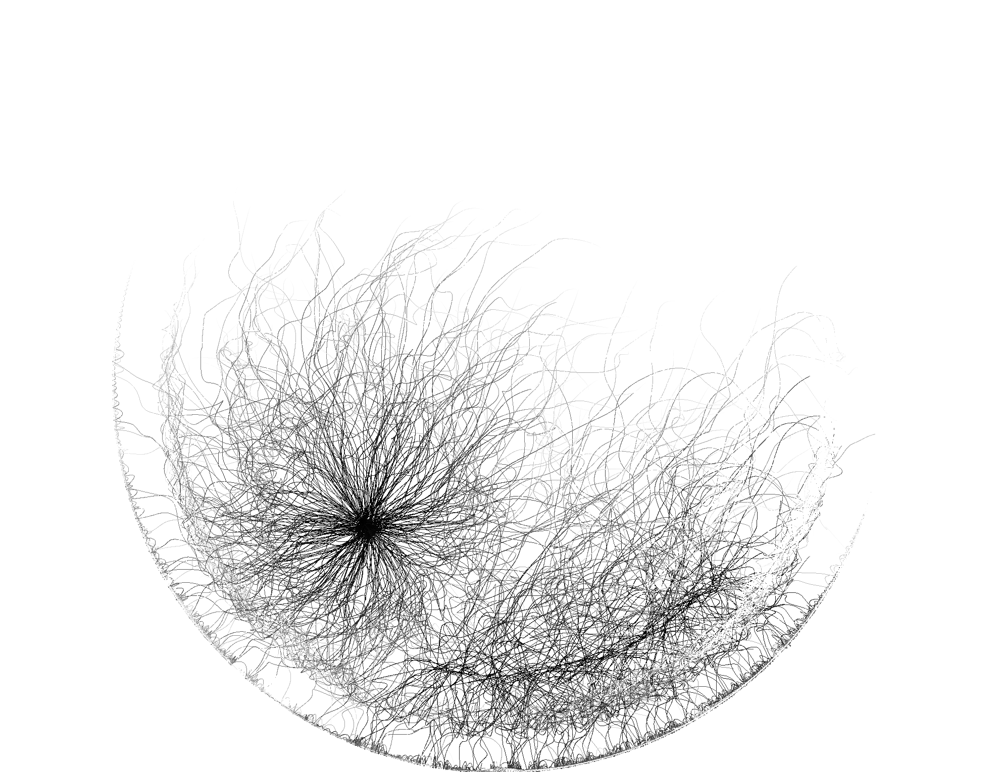

Generative Art using Raylib in Chez Scheme
==========================================



Many years ago now I worked on a (relatively large) series of
generative artworks called "Clocks" on account of the fact that all of
them were at least nominally clocks. The main idea was to use
deterministic processes coupled to the clock hands to generate novel
artworks by exploiting nonlinear dynamics.

Those clocks were originally written in a Lisp dialect called
"Gazelle" which I hacked together over the course of a year or so
pretty much expressly for the purpose of doing browser-based
generative art.

Gazelle ended up being more sophisticated than I could easily
maintain. Eventually I noticed a relatively challenging bug having to
do with run-time and expansion-time bindings. This looked pretty tough
to solve and by that time I was interested in hygeinic macro systems
anyway, which I'm happy using but not smart enough to write.

This repository is an attempt to port at least some of the Clocks to
Chez Scheme by using bindings to Raylib for graphics. Chez Scheme has
several benefits:

1. Chez Scheme is much faster than Javascript
2. It supports hygienic macros (syntax-case)
3. Its relatively easy to call C code and interact with C structs
4. It is an R6RS Scheme. I personally like R6RS (particularly R6RS
   record types)
   
Things of Interest
==================

I'm very interested in game development as well (in fact, my game "The
Death of the Corpse Wizard" is written in Gambit-C) and so some
Schemers may be interested in the bindings to raylib which are located in:

```
bindings/raylib/*.scm
```

These bindings are almost complete and semi-automatically generated by
the script in `gen-bindings.el` (written in Emacs Lisp because it was
easier to load JSON there and relatively easy to write out Scheme).

Some utilities are also provided in `bindings/raylib/helpers.scm`.

The SRFI directory should probably be a submodule because I believe
its Linux specific at this point. But I can't find the original git
repository. You may have to hack to make it all work.

Running Things
==============

Install Chez scheme, init the submodule, and say:

```
scheme clock-10.scm
```
